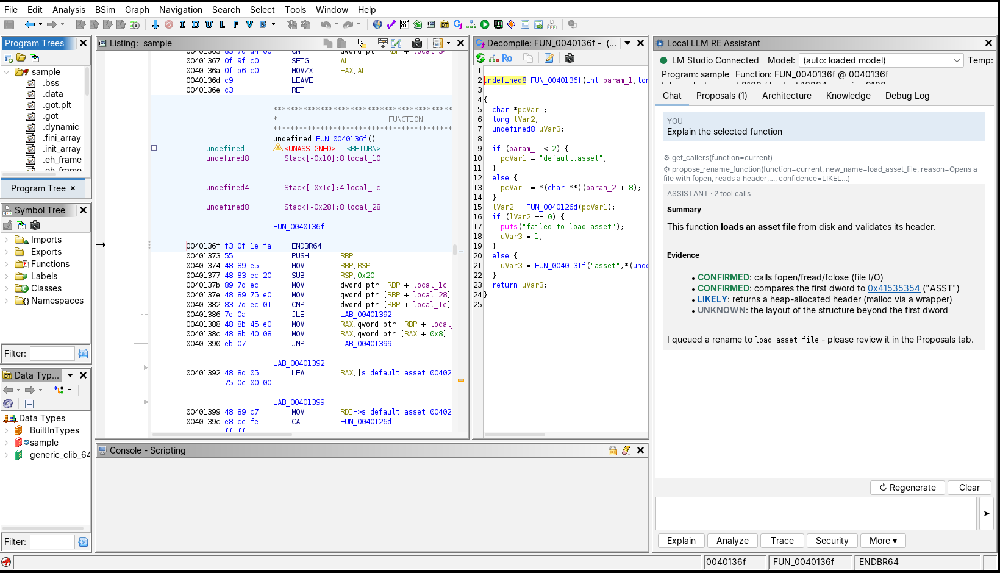
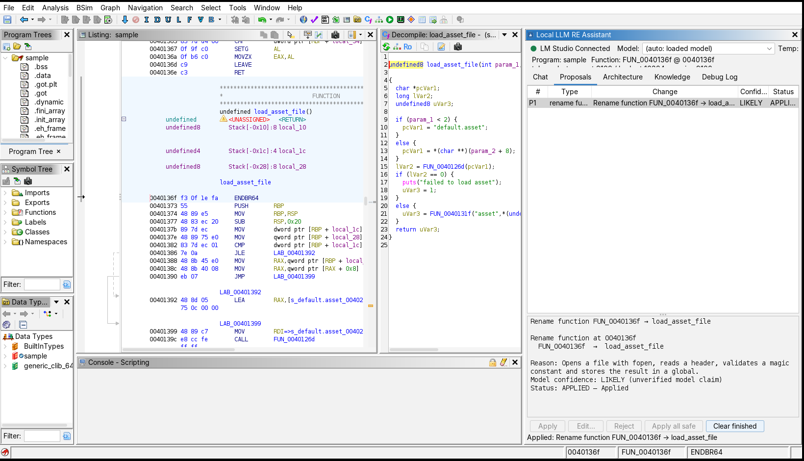

# Local LLM RE Assistant for Ghidra

An AI-assisted reverse-engineering environment inside Ghidra that talks **only to a locally hosted
model through LM Studio**. The model is an *agent*: instead of being fed a giant dump, it asks Ghidra
for exactly the evidence it needs (callers, strings, xrefs, decompiler output, data-flow…), reasons
with explicit **CONFIRMED / LIKELY / POSSIBLE / UNKNOWN** labels, and can *propose* names, comments,
signatures and types — which change your database only after you approve each one.



*Real Ghidra 12.0.1 session: the assistant (right) explains the function under the cursor after calling
`get_callers` and `propose_rename_function`; nothing was changed yet.*



*After pressing **Apply** in the Proposals tab: Listing and Decompiler show `load_asset_file`, and Ghidra's Undo is available.*

## Principles

1. **Local-first.** No cloud models, embeddings, telemetry, or uploads. Default network path: `Ghidra → localhost → LM Studio`. Non-loopback endpoints are blocked unless you explicitly allow them.
2. **Never silently modify the program.** Proposal → preview → your approval → validation → one undoable transaction.
3. **Evidence before conclusions.** The model must cite tool output and label certainty; decompiler output is treated as fallible.
4. **Bounded agent.** Limits on tool calls, steps, repeats, result size, time; Stop works immediately.
5. **Explicit permissions.** The model can call a fixed list of Ghidra inspection tools — no shell, process, filesystem or network access ([docs/tools.md](docs/tools.md)).

## Features

* Dockable **Local LLM RE Assistant** window: status header (connection, model, program, current function, token usage), chat with history, Stop / Regenerate / Clear, model picker, temperature, one-click **Explain · Analyze · Trace · Security**, plus *More ▾* (function comment, names, data types, relationships, program analysis, expert raw views).
* **Context-aware**: cursor/selection drives progressive context (signature, assembly, decompiler, callers/callees, strings, globals, xrefs) under a priority-based token budget; unchanged context is not resent; follow-ups ("what about the second caller?") use session memory.
* **41 tools** including `get_function_decompile`, `get_function_assembly`, `get_callers/callees`, `get_xrefs_to/from`, strings/symbol/data-type search, memory reads, `trace_value` (backward/forward data-flow with *verified* vs *inferred* labels) and `propose_*` tools.
* **Proposals tab**: preview, edit, approve, reject; analyst-chosen names/comments are protected until you confirm an overwrite. Supports rename function/variable/parameter, signature, comment, label, structure, enum, apply type.
* **Analyze Program**: progressive architecture analysis (facts → per-function summaries → subsystem synthesis) with a drill-down tree; the model never receives the whole binary.
* **Knowledge** tab: local SQLite notes (summaries, hypotheses, approved names, your notes).
* **Debug Log** and **Expert mode**: requests, tool calls/results, timings, token usage; program data is flagged 🔒 and maskable.
* Works with models **without native tool calling** via a validated `<tool_call>` fallback protocol.

## Install

Requirements: Ghidra 12.0.x, JDK 21, [LM Studio](https://lmstudio.ai).

1. **Get the extension ZIP** — build it ([docs/development.md](docs/development.md)):
   ```bash
   export GHIDRA_INSTALL_DIR=/path/to/ghidra_12.0.1_PUBLIC
   ./gradlew test buildExtension        # → dist/ghidra_12.0.1_PUBLIC_<date>_GhidraLocalLLM.zip
   ```
2. **Install** — Ghidra: *File → Install Extensions → ＋ → pick the ZIP → OK → restart Ghidra*.
3. **Enable** — open a program in CodeBrowser, *File → Configure → ☑ Local LLM RE Assistant*.

## Set up LM Studio

1. Install LM Studio and download an instruction-tuned model that supports tool use if possible (e.g. a recent Qwen / Llama / Mistral instruct build; ≥ 7B recommended). Models without tool support still work via the fallback protocol.
2. **Load the model with a context length ≥ 16384** (the assistant's default budget).
3. Open the **Developer** tab, enable **Start Server** (default `http://localhost:1234`).
4. In Ghidra's assistant window the header should read **● LM Studio Connected**. Otherwise press *Retry Connection* or open **⚙ Settings → Test Connection**, which checks: reachable → model available → chat completion works.

## Use

1. Open and auto-analyze a binary; put the cursor in a function of interest.
2. Press **Explain**, or ask in the box: *"What does this function do?"*, *"Where is this string used?"*, *"Find functions that look like file parsing"*, *"Trace param_2 backward"*.
3. Watch the tool activity lines (⚙) as the agent inspects Ghidra; read the evidence-labelled answer. Addresses and function names in answers are clickable.
4. Ask **Analyze** for a structured report, **Security** for evidence-based potential issues, or **More ▾ → Suggest names / Reconstruct data types / Generate function comment**.
5. Review the **Proposals** tab → *Apply* / *Edit…* / *Reject*. Apply is one undo step (*Edit → Undo*).
6. **More ▾ → Analyze Program** builds an architecture tree; select a subsystem → *Drill down*.

Right-click in the Listing → **Local LLM** for the same actions.

## Security model (summary)

* The model's output is data. Tool names are looked up in a fixed registry; arguments are schema-validated; nothing is `eval`ed or executed.
* Tools are classified `READ_PROGRAM` / `PROPOSE_CHANGE` / `LOCAL_KNOWLEDGE`; proposal and knowledge tools can be switched off.
* HTTP goes through a client with the system proxy disabled and a loopback-only guard.
* Prompts, tool results and the knowledge DB stay on your machine; the Debug Log is in memory and exported only when you ask.
* Prompt injection from binary content (strings, comments) can influence the model but not escape the tool boundary; every modification still needs your click.

See [docs/architecture.md](docs/architecture.md) and [docs/tools.md](docs/tools.md).

## Troubleshooting

| Symptom | Fix |
|---|---|
| "○ LM Studio Disconnected" | Start LM Studio → Developer → Start Server; check the URL in Settings (port 1234). |
| "No model is loaded" | Load a model in LM Studio. |
| "prompt exceeds the model's context window" | Reload the model with a larger context or lower *Context budget* in Settings. |
| Model ignores tools / malformed tool calls | Set *Tool protocol* to `PROMPTED` (or try a model with tool support). |
| Slow answers / timeouts | Raise *Request timeout*; use a smaller or quantized model; lower tool-call limit. |
| "Decompiler failed" in results | Ensure the function is analyzed; the assistant falls back to assembly. |
| Extension not listed in Configure | Rebuild against your exact Ghidra version and reinstall; check `application.log`. |
| Proposal can't be applied | Read the red/⚠ lines in its detail pane (stale, name conflict, would overwrite…). |

## Limitations

* Responses are not streamed token-by-token (the full reply appears when ready; Stop cancels the request).
* Quality depends on the local model; the tool boundary and evidence labels reduce, not eliminate, hallucination.
* Verified against Ghidra 12.0.1 and a mocked LM Studio; not yet exercised against every real model family.

## Project docs

[architecture](docs/architecture.md) · [tools](docs/tools.md) · [configuration](docs/configuration.md) · [development](docs/development.md) · [tests](tests/README.md)

Licensed under the Apache License 2.0 ([LICENSE](LICENSE)).
